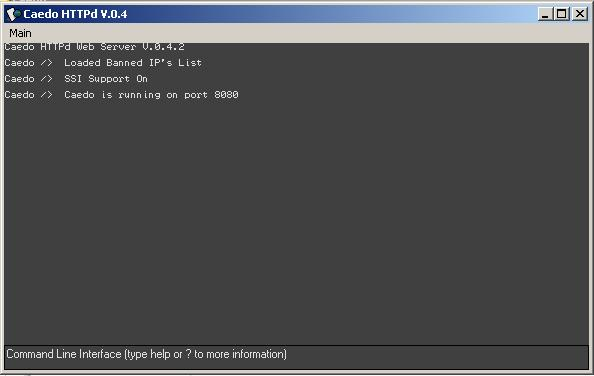



## Caedo HTTPd \(Web Server\)

### Description

Caedo HTTPd is a light-weight Web Server.

Its purpose is to have a small disk space foot-print, and a small memory foot-print, while not losing any functionality of the standard HTTP Daemon.

This version released ( 0.4.2 ) Supports many things, from one being FULL ( or around 90% ) PHP support. Another being GZIP Compression on out going files. It also support Virtual Hosts by the Host name, and extensive logging for each! Dont forget about SSI and Anti - Leeching (Anti - Hotlinking ) features.

There are many more features that can be listed here, but i would rather you test it for yourself.

It uses an implemention of the Winsock API ( No winsock Control, but rather a winsock replacement, so you can still understand the code ), and is clean coded and commented.

This version will not be supported in the future due to constant development and no need for previous version support.

You may stay up to date with us, download latest releases, or get involved with the development at our official website, http://caedo.0web.org .

IMPORTANT! This program makes use of the Visual basic ZLIB Library. Since pscode removes .dll's from the source, i have hosted the file.

You may download it here http://caedo.0web.org/files/vzlib.dll

ALSO, PLEASE READ THE README! its important!

so on a final note, please post feed back. Thats why this is here! thank you!  CSocketMaster does not support http://localhost !! if you wish to view your server locally try http://your_local_ip or http://you_external_ip
 
### More Info
 
I assume you are going to read the READ ME and download http://caedo.0web.org/files/vzlib.dll .

The read me will tell you what to do with this file.

             |
---                |---
**Submitted On**   |2006-07-27 12:00:00
**By**             |[SteveIno](https://github.com/Planet-Source-Code/PSCIndex/blob/master/ByAuthor/steveino.md)
**Level**          |Advanced
**User Rating**    |4.3 (13 globes from 3 users)
**Compatibility**  |VB 6\.0
**Category**       |[Complete Applications](https://github.com/Planet-Source-Code/PSCIndex/blob/master/ByCategory/complete-applications__1-27.md)
**World**          |[Visual Basic](https://github.com/Planet-Source-Code/PSCIndex/blob/master/ByWorld/visual-basic.md)
**Archive File**   |[Caedo\_HTTP2009107272006\.zip](https://github.com/Planet-Source-Code/steveino-caedo-httpd-web-server__1-66098/archive/master.zip)

